# 1. 部署nginx-ingress

## 1.1 环境准备

从github下载nginx-ingress controller最新的安装部署文件,并将部署文件解压缩到本地目录:

```
wget https://github.com/nginxinc/kubernetes-ingress/archive/v1.4.5.tar.gz
tar -zxvf v1.4.5.tar.gz
cd kubernetes-ingress-1.4.5/deployments
```

## 1.2 安装nginx-ingress controller

为nginx-ingress controller创建一个namespace和service account：

```
kubectl apply -f common/ns-and-sa.yaml
```

为NGINX默认Server配置TLS证书和key，并将TLS证书和key保存到secret中：

```
kubectl apply -f common/default-server-secret.yaml
```

**说明:** 建议使用合适的TLS证书和key替换default-server-secret.yaml文件中自签发的证书和key。

创建config map保存NGINX的自定义配置：

```
kubectl apply -f common/nginx-config.yaml
```
**说明:** 目前提供的config map中的data为空，您可以按需添加自定义配置。

为第1步中创建的service account配置RBAC：
```
kubectl apply -f rbac/rbac.yaml
```

为nginx-ingress controller创建service(采用NodePort方式, 而不是LoadBalance):
```
ZBMAC-C02VQ04-3:test suchengcai$ cat nginx-ingress-service.yaml
apiVersion: v1
kind: Service
metadata:
  name: nginx-ingress
  namespace: nginx-ingress
spec:
  externalTrafficPolicy: Cluster
  ports:
  - name: http
    port: 80
    protocol: TCP
    targetPort: http
  - name: https
    port: 443
    protocol: TCP
    targetPort: https
  selector:
    app: nginx-ingress
  type: NodePort
```

以Deployment的方式部署nginx-ingress controller:

```
# 修改deployment/nginx-ingress.yaml文件
ZBMAC-C02VQ04-3:deployments suchengcai$ cat deployment/nginx-ingress.yaml
apiVersion: extensions/v1beta1
kind: Deployment
metadata:
  name: nginx-ingress
  namespace: nginx-ingress
spec:
  replicas: 1
  selector:
    matchLabels:
      app: nginx-ingress
  template:
    metadata:
      labels:
        app: nginx-ingress
    spec:
      serviceAccountName: nginx-ingress
      containers:
      - image: nginx/nginx-ingress:1.4.5
        name: nginx-ingress
        ports:
        - name: http
          containerPort: 80
        - name: https
          containerPort: 443
        env:
        - name: POD_NAMESPACE
          valueFrom:
            fieldRef:
              fieldPath: metadata.namespace
        - name: POD_NAME
          valueFrom:
            fieldRef:
              fieldPath: metadata.name
        args:
          - -nginx-configmaps=$(POD_NAMESPACE)/nginx-config
          - -default-server-tls-secret=$(POD_NAMESPACE)/default-server-secret
          - -external-service=$(POD_NAMESPACE)/nginx-ingress
          - -v=3 # Enables extensive logging. Useful for trooublshooting.
         #- -report-ingress-status
         #- -enable-leader-election

# 部署nginx ingress
ZBMAC-C02VQ04-3:k8s_yaml suchengcai$ kubectl apply -f deployment/nginx-ingress.yaml

# 查看nginx-ingress是否部署成功
ZBMAC-C02VQ04-3:k8s_yaml suchengcai$ kubectl get deploy
NAME            DESIRED   CURRENT   UP-TO-DATE   AVAILABLE   AGE
nginx-ingress   1         1         1            1           64m
```

查看部署结果:

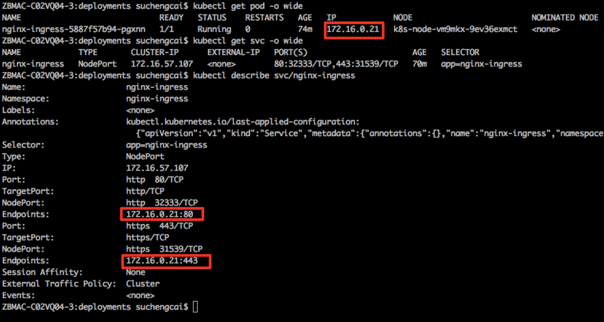

## 1.3 自建ALB

### 创建ALB

**说明:** 

- 必须与K8S集群同VPC
- 子网必须选择: k8s-xxx-nat-subnet-xxx

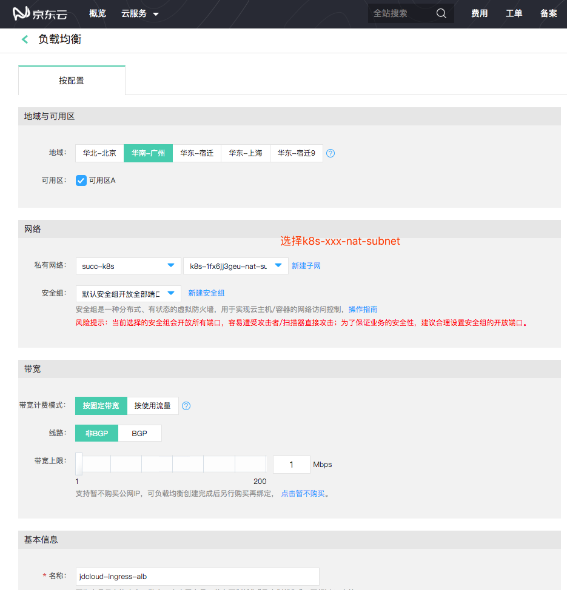

### 添加HTTP协议监听器

1 前端监听配置

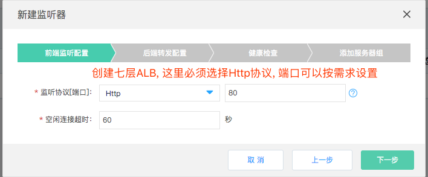

2 后端转发配置

首先确认nginx-ingress service的NodePort:

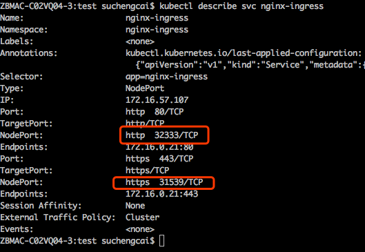

创建后端转发:

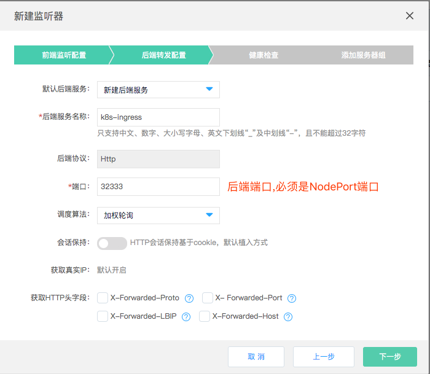

3 添加后端健康检查

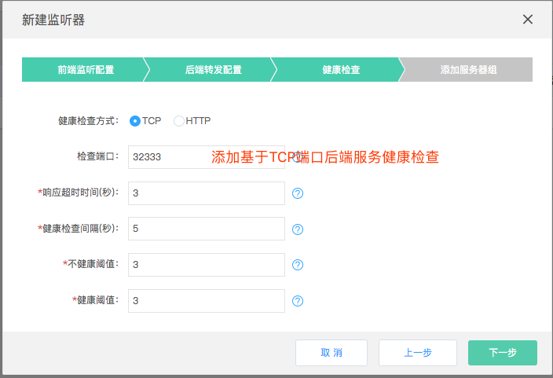

4 添加服务组

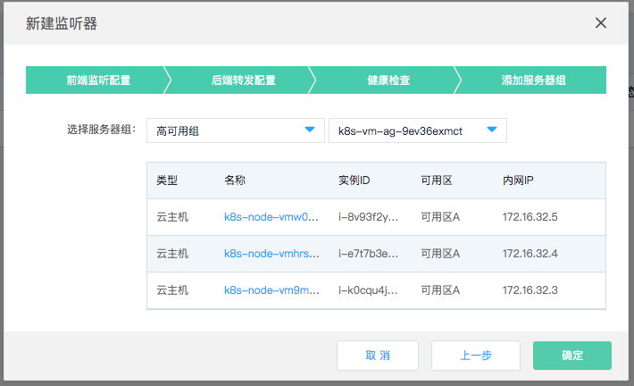

5 检查后端服务

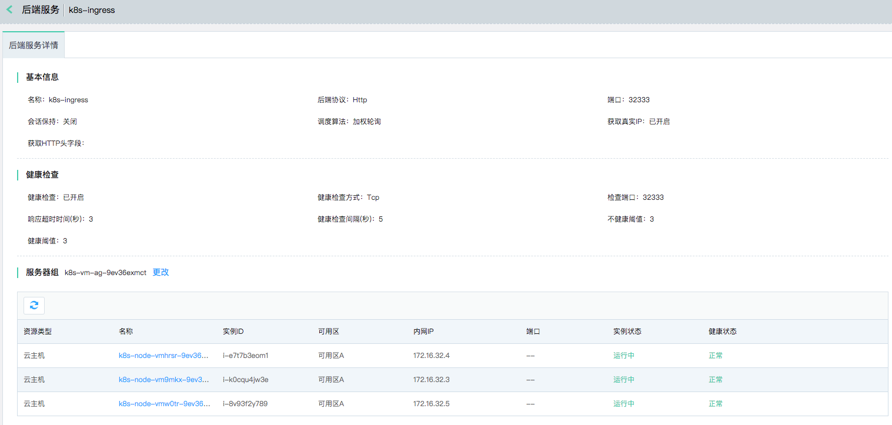

# 2 验证nginx-ingress

## 2.1 部署应用服务

```
ZBMAC-C02VQ04-3:test suchengcai$ cat nginx-demo.yaml
apiVersion: v1
kind: Service
metadata:
  name: nginx-demo-svc
spec:
  ports:
  - port: 80
    protocol: TCP
    targetPort: 80
  selector:
    app: nginx-demo
  type: ClusterIP
---
apiVersion: apps/v1
kind: Deployment
metadata:
  name: nginx-demo-deployment
  labels:
    app: nginx
spec:
  replicas: 3
  selector:
    matchLabels:
      app: nginx-demo
  template:
    metadata:
      labels:
        app: nginx-demo
    spec:
      containers:
      - name: nginx
        image: nginxdemos/hello:latest
        ports:
        - containerPort: 80
        
ZBMAC-C02VQ04-3:test suchengcai$ kubectl create -f nginx-demo.yaml
service/nginx-demo-svc created
deployment.apps/nginx-demo-deployment created

ZBMAC-C02VQ04-3:test suchengcai$ kubectl describe svc nginx-demo-svc
Name:              nginx-demo-svc
Namespace:         nginx-ingress
Labels:            <none>
Annotations:       <none>
Selector:          app=nginx-demo
Type:              ClusterIP
IP:                172.16.57.227
Port:              <unset>  80/TCP
TargetPort:        80/TCP
Endpoints:         172.16.0.13:80,172.16.0.22:80,172.16.0.25:80
Session Affinity:  None
Events:            <none>
ZBMAC-C02VQ04-3:test suchengcai$ kubectl get pod -o wide
NAME                                     READY   STATUS    RESTARTS   AGE   IP            NODE                         NOMINATED NODE
nginx-demo-deployment-66b4db8457-jz862   1/1     Running   0          94s   172.16.0.25   k8s-node-vm9mkx-9ev36exmct   <none>
nginx-demo-deployment-66b4db8457-ndsww   1/1     Running   0          94s   172.16.0.13   k8s-node-vmw0tr-9ev36exmct   <none>
nginx-demo-deployment-66b4db8457-pwwgz   1/1     Running   0          94s   172.16.0.22   k8s-node-vmhrsr-9ev36exmct   <none>
```

配置ingress

```
ZBMAC-C02VQ04-3:test suchengcai$ cat ingress.yaml
apiVersion: extensions/v1beta1
kind: Ingress
metadata:
  name: myingress
  annotations:
    metadata.annotations.kubernetes.io/ingress.class: "nginx"     #指定Ingress Resource创建时使用的Ingress Controller，本例使用上述创建的Nginx Controller
spec:
  rules:
  - host: nginx-ingress-test.jdcloud
    http:
      paths:
      - path: /nginx-demo
        backend:
          serviceName: nginx-demo-svc
          servicePort: 80
```

## 2.2 通过ALB+NginxIngress访问Service

157.255.51.125: 自建ALB公网IP
```
bash-3.2# echo "157.255.51.125  nginx-ingress-test.jdcloud" >> /etc/hosts
bash-3.2# ping -c 5 nginx-ingress-test.jdcloud
PING nginx-ingress-test.jdcloud (157.255.51.125): 56 data bytes
64 bytes from 157.255.51.125: icmp_seq=0 ttl=47 time=39.891 ms
64 bytes from 157.255.51.125: icmp_seq=1 ttl=47 time=40.189 ms
64 bytes from 157.255.51.125: icmp_seq=2 ttl=47 time=40.066 ms
64 bytes from 157.255.51.125: icmp_seq=3 ttl=47 time=39.727 ms
64 bytes from 157.255.51.125: icmp_seq=4 ttl=47 time=42.359 ms

--- nginx-ingress-test.jdcloud ping statistics ---
5 packets transmitted, 5 packets received, 0.0% packet loss
round-trip min/avg/max/stddev = 39.727/40.446/42.359/0.969 ms
bash-3.2#
```

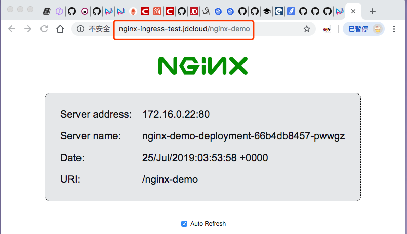

# 3. 验证源IP透传

## 3.1 部署echoserver应用

```
ZBMAC-C02VQ04-3:test suchengcai$ cat echo-server.yaml
apiVersion: v1
kind: Service
metadata:
  labels:
    app: echo-server
  name: echo-server-svc
  namespace: nginx-ingress
spec:
  ports:
  - name: http
    port: 80
    protocol: TCP
    targetPort: 8080
  selector:
    app: echo-server
  type: ClusterIP
---
apiVersion: apps/v1
kind: Deployment
metadata:
  name: echo-server-deployment
  namespace: nginx-ingress
  labels:
    app: echo-server
spec:
  replicas: 1
  selector:
    matchLabels:
      app: echo-server
  template:
    metadata:
      labels:
        app: echo-server
    spec:
      containers:
      - image: mirrorgooglecontainers/echoserver:1.4
        imagePullPolicy: IfNotPresent
        name: echocontainer
        ports:
        - containerPort: 8080
          protocol: TCP
      restartPolicy: Always
```

确认echoserver部署情况:

```
ZBMAC-C02VQ04-3:test suchengcai$ kubectl get pod -l "app=echo-server" -o wide
NAME                                      READY   STATUS    RESTARTS   AGE   IP            NODE                         NOMINATED NODE
echo-server-deployment-655f555cd4-9qxrv   1/1     Running   0          70s   172.16.0.45   k8s-node-vm9mkx-9ev36exmct   <none>
ZBMAC-C02VQ04-3:test suchengcai$ kubectl describe svc echo-server-svc
Name:              echo-server-svc
Namespace:         nginx-ingress
Labels:            app=echo-server
Annotations:       kubectl.kubernetes.io/last-applied-configuration:
                     {"apiVersion":"v1","kind":"Service","metadata":{"annotations":{},"labels":{"app":"echo-server"},"name":"echo-server-svc","namespace":"ngin...
Selector:          app=echo-server
Type:              ClusterIP
IP:                172.16.61.78
Port:              http  80/TCP
TargetPort:        8080/TCP
Endpoints:         172.16.0.45:8080
Session Affinity:  None
Events:            <none>
```

## 3.2 为echoserver配置Ingress

编辑`myingress`, 增加paths:

```
ZBMAC-C02VQ04-3:test suchengcai$ kubectl get ing/myingress -o yaml
apiVersion: extensions/v1beta1
kind: Ingress
metadata:
  annotations:
    kubectl.kubernetes.io/last-applied-configuration: |
      {"apiVersion":"extensions/v1beta1","kind":"Ingress","metadata":{"annotations":{"metadata.annotations.kubernetes.io/ingress.class":"nginx"},"name":"myingress","namespace":"nginx-ingress"},"spec":{"rules":[{"host":"nginx-ingress-test.jdcloud","http":{"paths":[{"backend":{"serviceName":"nginx-demo-svc","servicePort":80},"path":"/nginx-demo"}]}}]}}
    metadata.annotations.kubernetes.io/ingress.class: nginx
  creationTimestamp: "2019-07-25T03:13:49Z"
  generation: 2
  name: myingress
  namespace: nginx-ingress
  resourceVersion: "286035"
  selfLink: /apis/extensions/v1beta1/namespaces/nginx-ingress/ingresses/myingress
  uid: 38a99206-ae8a-11e9-8dde-fa163ebfb4dc
spec:
  rules:
  - host: nginx-ingress-test.jdcloud
    http:
      paths:
      - backend:
          serviceName: nginx-demo-svc
          servicePort: 80
        path: /nginx-demo
      - backend:
          serviceName: echo-server-svc
          servicePort: 80
        path: /echo-server
status:
  loadBalancer: {}
```

## 3.3 验证是否支持源IP透传

客户端公网IP: `14.119.106.240`

```
[root@succ-test ~]# curl -H "Host: nginx-ingress-test.jdcloud" http://157.255.51.125:80/echo-server
CLIENT VALUES:
client_address=172.16.0.21
command=GET
real path=/echo-server
query=nil
request_version=1.1
request_uri=http://nginx-ingress-test.jdcloud:8080/echo-server

SERVER VALUES:
server_version=nginx: 1.10.0 - lua: 10001

HEADERS RECEIVED:
accept=*/*
connection=close
host=nginx-ingress-test.jdcloud
user-agent=curl/7.29.0
x-forwarded-for=14.119.106.240, 172.16.32.4
x-forwarded-host=nginx-ingress-test.jdcloud
x-forwarded-port=80
x-forwarded-proto=http
x-real-ip=172.16.32.4
BODY:
-no body in request-[root@succ-test ~]#
```

echoserver返回`x-forwarded-for=14.119.106.240, 172.16.32.4`, 第一个IP是客户端公网IP.

结论: 为NginxIngress Controller, 自建七层ALB, 可以实现整条链路ClientIP透传.

# 4. Ingress升级为HTTPS

## 4.1 准备SSL证书和CA公钥

- [自建CA并且颁发SSL证书](create_ca.md)
- [云平台申请SSL证书](https://www.jdcloud.com/cn/products/ssl-certificate)

## 4.2 创建负载均衡证书

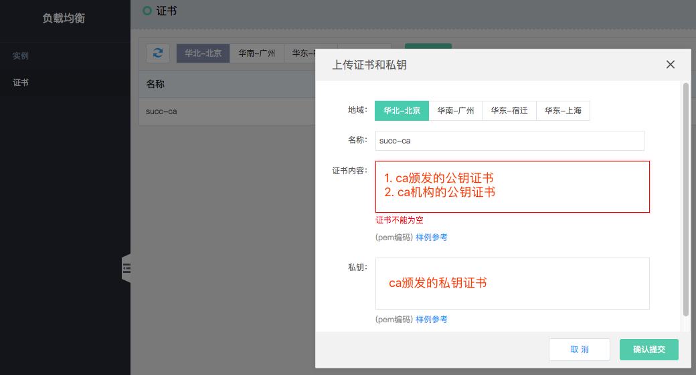

## 4.3 创建HTTPS listener

创建监听器, 协议为https, 并且选择合适的证书

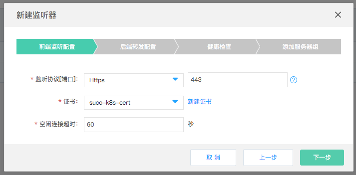

选择已有的http后端

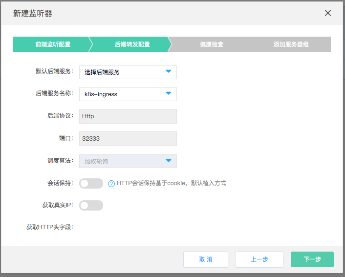

## 4.4 验证https协议ALB

### 验证浏览器访问

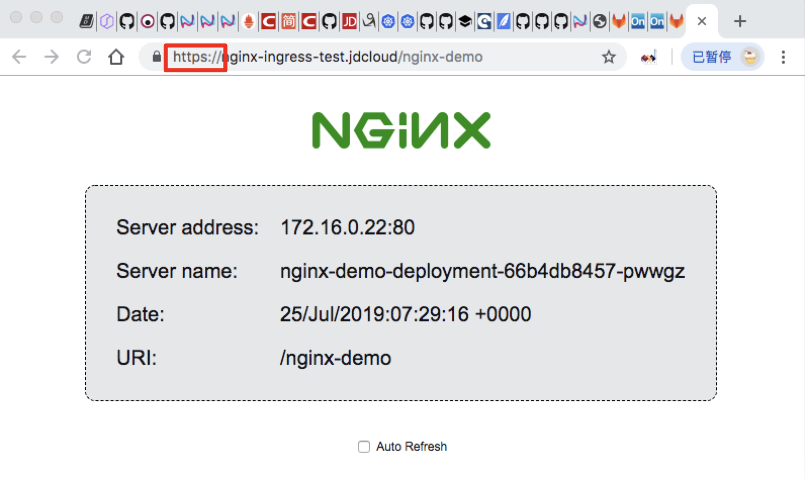

### 验证IP透传

```
[root@succ-test ~]# curl https://nginx-ingress-test.jdcloud:443/echo-server --cacert ca.pem
CLIENT VALUES:
client_address=172.16.0.21
command=GET
real path=/echo-server
query=nil
request_version=1.1
request_uri=http://nginx-ingress-test.jdcloud:8080/echo-server

SERVER VALUES:
server_version=nginx: 1.10.0 - lua: 10001

HEADERS RECEIVED:
accept=*/*
connection=close
host=nginx-ingress-test.jdcloud
user-agent=curl/7.29.0
x-forwarded-for=14.119.106.240, 172.16.32.3
x-forwarded-host=nginx-ingress-test.jdcloud
x-forwarded-port=80
x-forwarded-proto=http
x-real-ip=172.16.32.3
BODY:
-no body in request-[root@succ-test ~]#
```

# 5. 补充

Service为LoadBalance类型的Ingress, 如何开启IP透传功能

## 5.1 创建Service

创建LoadBalance类型的Service, 同时会在京东云平台上创建TCP类型的ALB.

```
apiVersion: v1
kind: Service
metadata:
  name: nginx-ingress-auto
  namespace: nginx-ingress
spec:
  type: LoadBalancer
  ports:
  - port: 80
    targetPort: 80
    protocol: TCP
    name: http
  - port: 443
    targetPort: 443
    protocol: TCP
    name: https
  selector:
    app: nginx-ingress
```

自动创建的ALB公网IP为: `117.48.227.209`

## 5.2 京东云控制台修改ALB支持源IP透传

由Service自动创建ALB的后端服务**源IP透传功能**是关闭的, 需要登录京东云控制台手动开启:
   > 1. 编辑负载均衡`http`后端服务
   > 2. 开启`获取真实IP`

## 5.3 修改ConfigMap

编辑nginx-ingress/nginx-config ConfigMap 增加如下信息:
```
data:
  proxy-protocol: "True"
  real-ip-header: "proxy_protocol"
  set-real-ip-from: "${k8s-xxx-node-subnet-xxx cidr}"  # set-real-ip-from: 172.16.32.0/20
```

## 5.4 验证IP透传

客户端公网IP: `14.119.106.240`

```
[root@succ-test ~]# curl -H "Host: nginx-ingress-test.jdcloud" http://117.48.227.209:80/echo-server
CLIENT VALUES:
client_address=172.16.0.21
command=GET
real path=/echo-server
query=nil
request_version=1.1
request_uri=http://nginx-ingress-test.jdcloud:8080/echo-server

SERVER VALUES:
server_version=nginx: 1.10.0 - lua: 10001

HEADERS RECEIVED:
accept=*/*
connection=close
host=nginx-ingress-test.jdcloud
user-agent=curl/7.29.0
x-forwarded-for=14.119.106.240
x-forwarded-host=nginx-ingress-test.jdcloud
x-forwarded-port=80
x-forwarded-proto=http
x-real-ip=14.119.106.240
BODY:
-no body in request-[root@succ-test ~]#
```

echoserver返回的信息`x-forwarded-for=14.119.106.240` 与客户端IP相同, 验证通过

## 5.5 ingress升级https

由Service自动创建ALB的后端服务**源IP透传功能**是关闭的, 需要登录京东云控制台手动开启:
   > 1. 编辑负载均衡`https`后端服务
   > 2. 开启`获取真实IP`

### 创建Secret资源

根据用户申请的SSL证书创建secret.

```
kubectl create secret tls ingress-ssl-secret --cert web-server.pem --key web-server-key.pem
```

查看创建成功的secret
```
kubectl describe secret/ingress-ssl-secret
Name:         ingress-ssl-secret
Namespace:    nginx-ingress
Labels:       <none>
Annotations:  <none>

Type:  kubernetes.io/tls

Data
====
tls.crt:  1448 bytes
tls.key:  1675 bytes
```

### 更改ingress资源

`kubectl edit ingress myingress`重新编辑ingress增加tls字段

```
ZBMAC-C02VQ04-3:ssl_cert suchengcai$ kubectl get ingress myingress -o yaml
apiVersion: extensions/v1beta1
kind: Ingress
metadata:
  annotations:
    kubectl.kubernetes.io/last-applied-configuration: |
      {"apiVersion":"extensions/v1beta1","kind":"Ingress","metadata":{"annotations":{"metadata.annotations.kubernetes.io/ingress.class":"nginx"},"name":"myingress","namespace":"nginx-ingress"},"spec":{"rules":[{"host":"nginx-ingress-test.jdcloud","http":{"paths":[{"backend":{"serviceName":"nginx-demo-svc","servicePort":80},"path":"/nginx-demo"}]}}]}}
    metadata.annotations.kubernetes.io/ingress.class: nginx
  creationTimestamp: "2019-07-25T03:13:49Z"
  generation: 4
  name: myingress
  namespace: nginx-ingress
  resourceVersion: "309938"
  selfLink: /apis/extensions/v1beta1/namespaces/nginx-ingress/ingresses/myingress
  uid: 38a99206-ae8a-11e9-8dde-fa163ebfb4dc
spec:
  rules:
  - host: nginx-ingress-test.jdcloud
    http:
      paths:
      - backend:
          serviceName: nginx-demo-svc
          servicePort: 80
        path: /nginx-demo
      - backend:
          serviceName: echo-server-svc
          servicePort: 80
        path: /echo-server
  tls:
  - hosts:
    - nginx-ingress-test.jdcloud
    secretName: ingress-ssl-secret
status:
  loadBalancer: {}
```

### 浏览器访问验证

浏览器访问`https://web-server-test.jdcloud.com/jdcloud`提示证书不被信任. 这是因为SSL证书是我们自建的CA签名的, 需要将我们自建的CA的ca.pem导入到操作系统, 并设置永久信任.

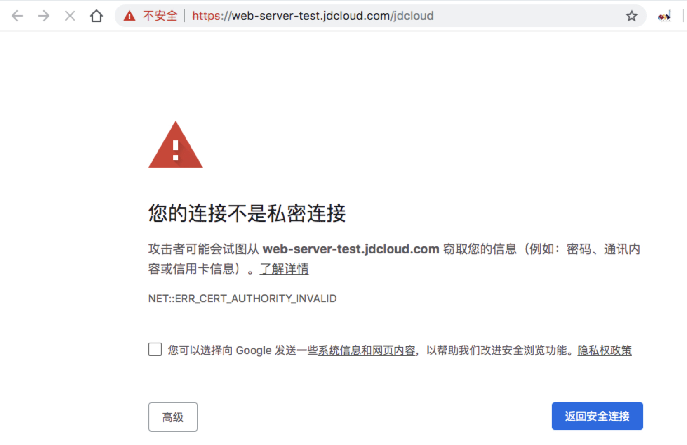

对于Mac, 操作如下, 导入自建CA的ca.pem, 并设置成始终信任:

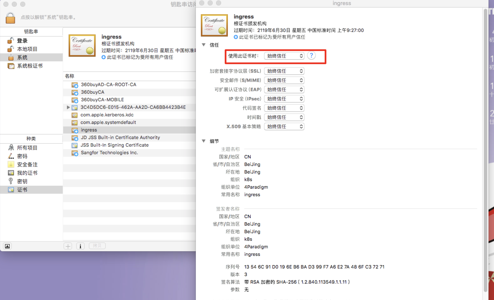

再次访问`https://web-server-test.jdcloud.com/jdcloud`效果如下:

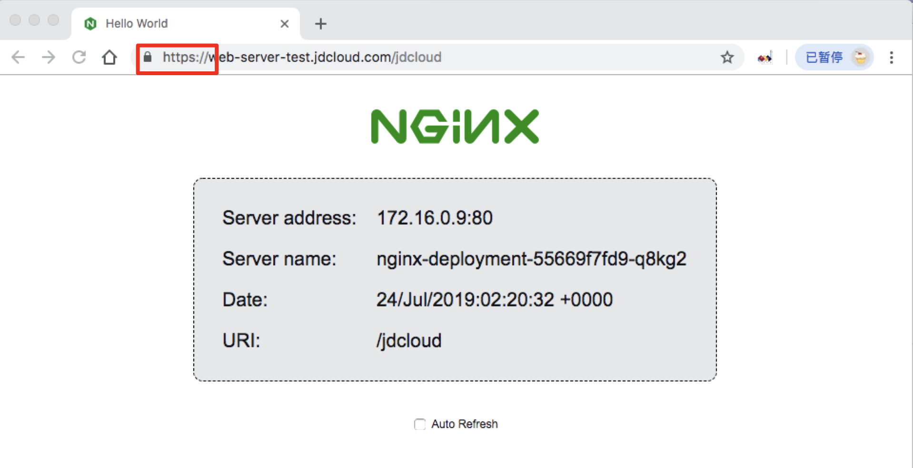
